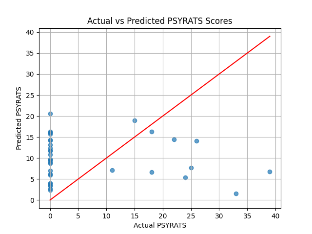

# Neurotech: Predicting Brain Structural Changes in Schizophrenia Patients with AVH

## Project Overview
This project analyzes neuroimaging data (MRI) to investigate potential structural brain changes in schizophrenia patients experiencing auditory verbal hallucinations (AVH). Using machine learning techniques, the project replicates and builds upon findings from published research, with a unique methodological approach.

The project was originally developed with the aim of presenting at the 2025 California Neurotech Conference at UCSD, although it was not ultimately submitted.

## References
- [OpenNeuro Dataset (ds004302)](https://openneuro.org/datasets/ds004302/versions/1.0.1) — Source of MRI scans.
- [Original Research Paper (PLOS ONE)](https://journals.plos.org/plosone/article?id=10.1371/journal.pone.0276975#sec008) — Study this project is based on.
- [PSYRATS Scale (Psychological Medicine)](https://www.cambridge.org/core/journals/psychological-medicine/article/scales-to-measure-dimensions-of-hallucinations-and-delusions-the-psychotic-symptom-rating-scales-psyrats/F98A9A5A0D5CB9715161C1547DB010B8) — Clinical measure for hallucination severity.
- [SynthSeg Label Table (GitHub)](https://github.com/BBillot/SynthSeg/blob/master/data/labels%20table.txt) — Segmentation labels used for voxel analysis.

---

## Topic
Predicting or identifying structural brain changes in schizophrenia patients with AVH using MRI data and machine learning.

---

## Methods

### lab.py
- **Dataset**: 71 MRI brain scans categorized as Healthy Controls (HC), AVH-, and AVH+.
- **Approach**:
  - Took the middle slice of each MRI scans (3D) and flattened into 1D arrays to serve as input for machine learning.
  - Models were trained using **XGBoost**.
  - Target variable: **PSYRATS scores**, representing AVH severity.

### lab2.py
- **Additional Processing**:
  - MRI scans segmented using **SynthSeg**.
  - Analysis conducted at the voxel-label level.
  - Machine learning models built for individual brain regions.

---

## Unique Aspects of This Project
- **No use of FSL**: The original study used FSL for data preprocessing; this project entirely bypassed it.
- **XGBoost for Neuroimaging**: Instead of using convolutional neural networks (CNNs) or more typical neuroimaging-specific methods, XGBoost was applied, an uncommon but interpretable choice for structural prediction.

---

## Results

### Overall Findings
- Results align with the original research: **the relationship between AVH and brain structure is complex and no strong structural signatures were detected via MRI**.

---

### lab.py Results


---

### lab2.py Results
**Performance per Label of Interest** (Selected brain regions):

| Label | Mean Squared Error | R² Score |
|:-----:|:------------------:|:--------:|
| 2 | 241.19 | -0.65 |
| 3 | 410.03 | -1.81 |
| 4 | 390.69 | -1.68 |
| 5 | 443.51 | -2.04 |
| 7 | 497.73 | -2.41 |
| 8 | 274.73 | -0.88 |
| 10 | 268.56 | -0.84 |
| 11 | 195.78 | -0.34 |
| 12 | 251.74 | -0.73 |
| 13 | 397.12 | -1.72 |
| ... | ... | ... |

_(Full table available in the code or result files.)_

---

## Improvements and Future Directions
- The original study indicated that while **MRI data did not reveal meaningful structural differences**, **fMRI (functional MRI)** data showed more promising findings.
- Future work could extend this project by incorporating **functional imaging modalities** to better capture dynamic brain activity related to AVH.

---

## Repository Structure
```
/neurotech
│
├── lab.py      # MRI to 1D vector analysis with XGBoost
├── lab2.py     # SynthSeg segmentation + per-voxel XGBoost models
├── img.png     # Performance visualization for lab.py
├── README.md   # Project documentation
